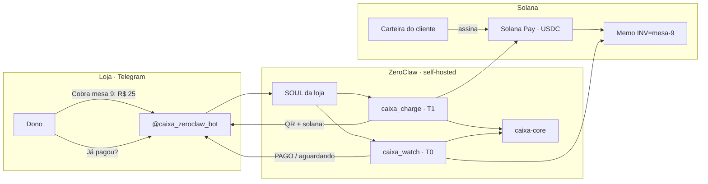
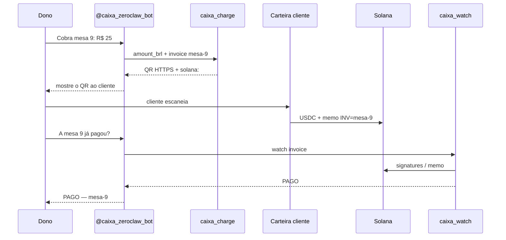

<p align="center">
  
</p>

<h1 align="center">Caixa</h1>

<p align="center">
  <strong>Terminal de cobrança da loja no Telegram</strong><br/>
  Reais no chat · USDC no Solana · o agente nunca segura a chave
</p>

<p align="center">
  Bot: <a href="https://t.me/caixa_zeroclaw_bot"><strong>@caixa_zeroclaw_bot</strong></a>
  ·
  <a href="SHOWCASE.md">Showcase</a>
  ·
  <a href="operator/DAY.md">Dia a dia</a>
  ·
  <a href="operator/README.md">Setup</a>
</p>

---

## O problema

A loja **já vive no Telegram**. Cobrar USDC sem Caixa vira:

- colar endereço na mão e errar valor  
- ou entregar **hot wallet** a um bot com LLM no meio  

Isso não é um chat de IA. É o **caixa da operação**.

## O produto

| Quem | Faz o quê |
|------|-----------|
| Dono | `Cobra mesa 9: R$ 25` no [@caixa_zeroclaw_bot](https://t.me/caixa_zeroclaw_bot) |
| Caixa | Devolve QR + `solana:` (USDC, memo da mesa) |
| Cliente | Abre o QR no Phantom / Solflare e assina |
| Dono | `A mesa 9 já pagou?` → **PAGO** / ainda não |

Custódia **T1 / T0**: monta cobrança e lê a chain. Cliente assina na carteira dele.

## Como funciona



### Fluxo de cobrança (detalhe)



## Por que é seguro para a loja

- **Sem chave no agente** — não existe path de assinatura  
- **Allowlist de mint + caps** no WASM — o modelo não contorna  
- **Injection fail-closed** — mint estranha / `private_key` no memo → recusa  
- **Estorno** via `caixa_transfer_build` (unsigned + durable nonce) — humano assina  

Detalhes: [operator/INJECTION.md](operator/INJECTION.md) · [operator/LAYERING.md](operator/LAYERING.md)

## Dia a dia

Ver [operator/DAY.md](operator/DAY.md).

```
Cobra mesa 9: R$ 25
A mesa 9 já pagou?
```

## Subir o terminal

Kit de operador (uma noite): [operator/README.md](operator/README.md)

```text
crates/caixa-core/                 Pay, RPC, SPL, quote BRL→USDC
plugins/caixa-charge/              cobrança Solana Pay
plugins/caixa-watch/               conferência on-chain (+ SOP cron)
plugins/caixa-transfer-build/      estorno/saque unsigned
operator/                          SOUL, config, dia a dia
skills/caixa-terminal/             fallback stock binary (opcional)
```

```bash
(cd crates/caixa-core && cargo test)
(cd plugins/caixa-charge && cargo test)
(cd plugins/caixa-watch && cargo test)
(cd plugins/caixa-transfer-build && cargo test)
```

## Showcase / juízes

Write-up completo: [SHOWCASE.md](SHOWCASE.md)

---

MIT OR Apache-2.0 · Built for shops that already run on Telegram · Powered by [ZeroClaw](https://github.com/zeroclaw-labs/zeroclaw) + Solana
